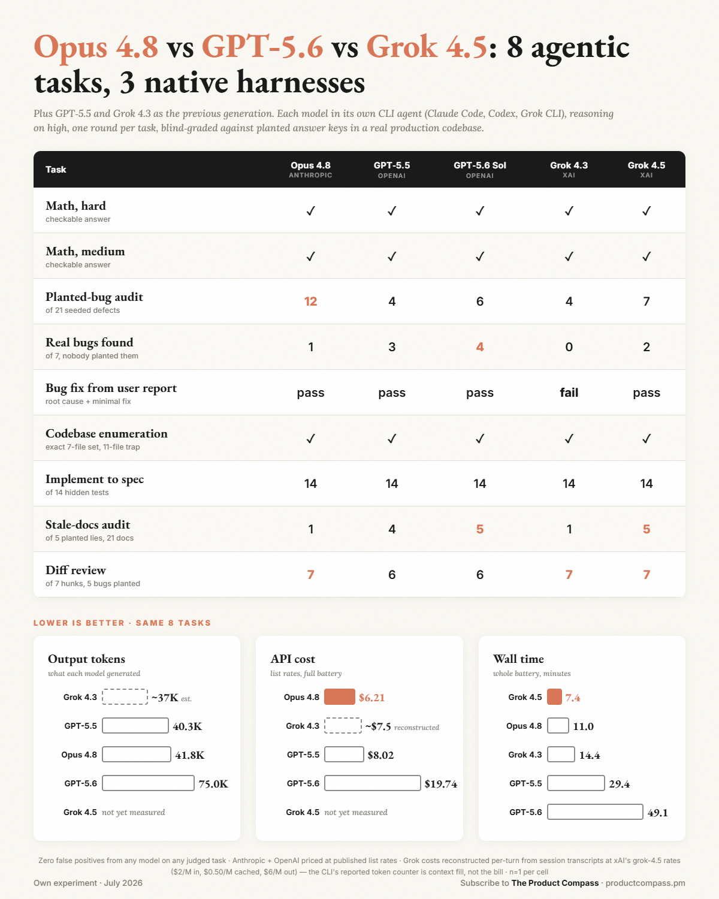

# five-models-three-harnesses — five frontier coding models, each in its own agentic CLI, on one real codebase

**Question:** Five frontier coding models shipped inside three different agentic CLIs. On a *real* production codebase — not a toy — which one is actually best at agentic work, and at what cost? And is "best" even one model, or does the answer split by task? Two generations of each vendor are in the grid: Anthropic's Opus 4.8, OpenAI's GPT-5.5 and GPT-5.6 Sol, and xAI's Grok 4.3 and Grok 4.5.

**Method:** One real app (private; de-identified here — the same app used in [frontier-vs-open-audit/](../frontier-vs-open-audit/)). **8 tasks**, each run through each model **in its own native CLI agent**, **one round per (task, model) cell**, reasoning effort **`high`** requested everywhere (not each model's ceiling). Objective tasks are graded deterministically; the read/review tasks are **blind-graded** against hand-planted answer keys, model identity hidden from the grader.

| Model | Slug | Harness | Effort `high` honored? | Machine |
|---|---|---|---|---|
| Opus 4.8 | `claude-opus-4-8` | Claude Code CLI (`claude -p … stream-json`) | yes (`--effort high`) | primary |
| GPT-5.5 | `gpt-5.5` | Codex CLI (`codex exec --json`) | yes | primary |
| GPT-5.6 Sol | `gpt-5.6-sol` | Codex CLI (`codex exec --json`) | yes | primary |
| Grok 4.3 | `grok-build` | grok CLI over ACP-stdio ([harness/grok_acp.py](harness/grok_acp.py)) | **no — flag inert** (`supports_reasoning_effort=false`) | primary |
| Grok 4.5 | `grok-4.5` | grok CLI over ACP-stdio ([harness/grok_acp.py](harness/grok_acp.py)) | **yes — binds** (`supports_reasoning_effort=true`) | **remote (2-core VM-class)** |

Grok exposes no per-turn token split in headless mode, so its leg runs over the Agent Client Protocol (ACP) via a custom stdio driver ([harness/grok_acp.py](harness/grok_acp.py)) that acts as the sandbox client. All five ran the same 8 prompts through [harness/runner.py](harness/runner.py).

**The 8-task battery** (task *types*; the private file names and the enumeration target are withheld):

| # | Type | Mode | Grading |
|---|---|---|---|
| T1 | Hard number-theory count, single checkable integer | reason | deterministic |
| T2 | Inclusion-exclusion count, single checkable integer | reason | deterministic |
| T3 | Full-repo pre-release **security audit** of a seeded codebase, read-only; the [June audit prompt](prompt-audit.txt) verbatim | read | blind vs a hand-planted seed key (21 live seeds + 7 superseded-history seeds) + tracked genuine bugs |
| T4 | **Bug fix from a user report** — one-file minimal repair | write | scoped git-diff (correct file, correct fix, no collateral edits) |
| T5 | **Codebase enumeration** — every file matching a precise usage criterion, against an import-only decoy set (11-file trap vs the true 7-file call set) | read | blind vs the exact 7-file key |
| T6 | **Implement-to-spec** — write a utility to a written spec | write | 14 hidden unit tests (`bun test`, zero-install) |
| T7 | **Documentation-staleness audit** — find claims the code no longer supports (5 planted, across ~21 doc files) | read | blind vs the 5-plant key |
| T8 | **Diff review** — approve/reject a 7-hunk patch (5 seeded defects to reject, 2 innocent hunks to approve) | review | blind vs the reject/approve key |

**Blind judging:** the three run-1 arms (Opus / GPT-5.5 / Grok 4.3) were judged as an anonymized, per-task shuffled 3-report set by four independent Opus judges (one per read/review task) with the key + the repo for claim verification; zero identity leakage was found in the shuffled set. Grok 4.5 and GPT-5.6 were judged **solo** by fresh judges with the identical rubric and keys — a noted asymmetry. Deterministic grades (T1/T2/T4/T6) come from the runner.

---

## Results — correctness scoreboard

One round per cell. Full content-free grid: [scoreboard.csv](scoreboard.csv).

| Task | Opus 4.8 | GPT-5.5 | GPT-5.6 Sol | Grok 4.3 | Grok 4.5 |
|---|---|---|---|---|---|
| T1 math-hard | ✅ | ✅ | ✅ | ✅ | ✅ |
| T2 math-medium | ✅ | ✅ | ✅ | ✅ | ✅ |
| **T3 planted bugs caught /21** | **12** | 4 | 6 | 4 | 7 |
| T3 superseded seeds traced with history /7 | **3** | 0 | 0 | 0 | 0 |
| T3 superseded seeds over-claimed as live | 2 | 0 | 0 | 0 | 0 |
| T3 real (unplanted) bugs found /7 | 1 | 3 | **4** | 0 | 2 |
| T3 false positives | 0 | 0 | 0 | 0 | 0 |
| T4 bug-fix from report | ✅ pass | ✅ pass | ✅ pass | ❌ fail | ✅ pass |
| T5 enumeration (trap) | ✅ EXACT | ✅ EXACT | ✅ EXACT | ✅ EXACT | ✅ EXACT |
| T6 implement-to-spec /14 | 14/14 | 14/14 | 14/14 | 14/14 | 14/14 |
| **T7 doc plants caught /5** | 1 | 4 | **5** | 1 | **5** |
| T7 genuine unplanted staleness (all verified) | 12 | 28 | **83** | 9 | ~49 |
| T8 diff review net /7 | **7/7** | 6/7 | 6/7 | **7/7** | **7/7** |

**No arm produced a single false positive on any judged task.** The differentiators are recall, scope discipline, and hands — not hallucination rate.

Four tasks are **saturated**: T1, T2, T5, and T6 were solved perfectly by all five. They bound the floor (every model can do them) but do not discriminate. All the signal is in T3, T4, T7, T8.

---

## Results — speed, tokens, cost (whole battery)

| | Opus 4.8 | GPT-5.5 | GPT-5.6 Sol | Grok 4.3 | Grok 4.5 |
|---|---|---|---|---|---|
| Total wall-clock | **11.0 min** | 29.4 min | 49.1 min | 14.4 min | 7.4 min* |
| Longest single cell | T7 296s | T7 760s | T7 1339s | T7 246s | T3 174s |
| Output tokens (battery) | 41.8K | 40.3K | 75.0K | ~37K † | not measured † |
| API-equivalent cost | **$6.21** | $8.02 | $19.74 | ~$7.5 † | not measured (est. $6–10) † |

Cost is at published **list rates** and summed over each turn's usage: Anthropic (in $5 / cache-write $6.25 / cache-read $0.5 / out $25 per 1M); OpenAI, both GPT tiers (in $5 / cached $0.5 / out $30 per 1M). GPT-5.6 Sol publishes the same rates as GPT-5.5, so its 3.2× cost over Opus and 2.5× over GPT-5.5 is grind, not a price hike. Per-cell numbers: [metrics.csv](metrics.csv).

**\*** Grok 4.5 ran on a **different, weaker (2-core, VM-class) machine** — its wall-clock is **not comparable across machines** (network + CPU differ). Its correctness and tokens are comparable; its speed column is a floor, not a measurement.

**†** The grok token/cost figures are reconstructions or estimates, not direct reads — because the grok CLI's token counter measures the wrong thing. See the next section.

---

## The token-accounting defect (read this before trusting any grok cost number)

A forensic pass on the raw data found that **the grok CLI's ACP token counter reports final context size, not cumulative billed tokens.**

- Claude Code and Codex report token usage as a **cumulative sum over every turn** — the number that maps to your bill.
- The grok CLI's ACP `_meta` fields (`totalTokens`, `inputTokens`, `cachedReadTokens`) report the **final context size** at the end of the session — a context-fill gauge. The CLI even resets it to 0 on `/compact`. It is *not* a running total of what you were charged.

Comparing those two meters raw is a category error. On this battery it understated grok's real token consumption **~26×**: the raw counter implied about **$0.29** for the Grok 4.3 run at xAI's list rates; reconstruction put the real figure near **$7.5** — in the same ballpark as Opus ($6.21) and GPT-5.5 ($8.02), not two orders of magnitude below them.

**Reconstruction method (Grok 4.3):** rebuild the per-turn *context staircase* from the session transcript. Cached-read tokens ≈ the sum of all prior turns' contexts (each turn re-reads the growing conversation); new-input telescopes up to the final context size; output is estimated from the generated text. Summing those per-turn charges — the way Claude Code and Codex already do internally — gives the ~$7.5 figure and the ~37K output-token estimate. Grok 4.5's transcripts live on the remote machine and weren't reconstructed, so its cost is left as an honest **estimate ($6–10)** rather than a fabricated precise number.

**Practitioner takeaway:** the token counter your agent CLI shows you may be *context fill*, not your bill. If you are comparing agent CLIs on cost, confirm each one is reporting a cumulative per-turn sum before you trust the total — or you will conclude a model is an order of magnitude cheaper than it is (here, ~26× on the raw numbers). Every raw grok token cell in [metrics.csv](metrics.csv) is flagged `context-snapshot-DEFECT` for exactly this reason.

---

## Findings

1. **No generalist — every frontier model owned a different axis.** Opus owns planted-bug recall (12/21, 2–3× the field) and is the only model that read migration history (3 superseded seeds correctly de-escalated). GPT-5.6 owns the exhaustive doc sweep (5/5 plants + 83 verified-genuine extras) and the best real-bug haul (4/7). Grok 4.5 owns review precision and terseness (7/7 diff review, EXACT enumeration, far less prose than the field). **Union of all five on the planted-bug audit: 17/21 — no single arm above 12.** There is no one model to reach for; the best "model" is an ensemble.

2. **Zero false positives, from every arm, on every judged task.** Across the audit, the enumeration trap, the doc sweep, and the diff review, not one model invented a bug, a file, or a citation that didn't check out. The spread is entirely in *what they caught and how tightly they scoped*, never in trustworthiness of the positives.

3. **The 4.3 → 4.5 jump is the biggest single move in the table — and it's confounded.** Grok 4.5 kept everything 4.3 was good at (EXACT enumeration, 14/14, 7/7 review) and fixed what it wasn't: the only T4 fail became a clean minimal pass, live seeds 4 → 7, real bugs 0 → 2, doc plants 1/5 → 5/5. But reasoning effort was **inert** on 4.3 (`supports_reasoning_effort=false`) and **binds** on 4.5 — so part of the jump is the effort dial, not the model. Don't read the full delta as pure model improvement.

4. **GPT-5.5 → 5.6 is a grind upgrade, not a smarts upgrade.** 5.6 Sol improved by reading *more*: live seeds 4 → 6, real bugs 3 → 4, doc plants 4/5 → 5/5 — bought with ~4× the tokens on repo sweeps and 2.5× the dollars ($19.74 vs $8.02, the most expensive arm in the battery). On the diff review the two returned **identical** verdicts (both 6/7, both rejecting the same innocent-but-inaccurate comment hunk). More coverage, same judgment.

5. **The token-accounting defect is itself a finding.** Two agent CLIs reporting cumulative billed tokens and one reporting context fill are not comparable without correction. Left raw, it made grok look ~26× cheaper than it billed. If you benchmark agent CLIs, verify the meter before the model. (See section above.)

6. **Harness personality shows through.** The OpenAI arms share a "strict reviewer" instinct — both GPT tiers rejected a factually-wrong-but-inert comment on T8 that both grok arms and Opus approved. The grok arms share terseness — both wrote far less prose than the others regardless of the capability gap between 4.3 and 4.5.

---

## Caveats (all of them)

- **n = 1 per cell.** Single round per (task, model). Treat every delta as directional, not significant.
- **Saturated tasks.** T1/T2/T5/T6 were perfect for all five — they bound the floor, they don't discriminate. Only T3/T4/T7/T8 separate the models.
- **Grok 4.3's effort flag was inert.** `--reasoning-effort high` was sent for parity but ignored by `grok-build` (model default). It binds on Grok 4.5. This is a real confound on the 4.3 → 4.5 comparison — some of that jump is the dial.
- **Grok 4.5 ran on a different, weaker machine** (2 logical cores, VM-class). Wall-clock is not comparable across machines; tokens and correctness are.
- **Judge asymmetry.** The three run-1 arms were judged in a blind, shuffled 3-report set; Grok 4.5 and GPT-5.6 were judged solo with the same rubric and keys. Same standard, different framing.
- **The token/cost defect.** Grok token and cost figures are reconstructed (4.3) or an honest estimate (4.5), never a direct read. The three cumulative arms (Opus, GPT-5.5, GPT-5.6) are summed per-turn usage at list rates.
- **Native-harness tool asymmetry (by design).** Claude is fully shell-denied (navigates with read/search tools only); Codex keeps its shell under a read-only OS sandbox; Grok over ACP is sandboxed client-side with `git` denied (so it can't `git diff` the committed audit seeds). Each model runs in *its own* native posture, not a single unified harness.
- **High run-to-run variance is known on the audit tasks.** The same seeded repo + audit prompt ran as a 10-run-per-cell battery in June ([frontier-vs-open-audit/](../frontier-vs-open-audit/)); Opus's June 10-run **mean** at effort `high` was ~12% planted-bug recall, versus **57% (12/21)** in this single July `high` run. That gap is large enough that it's unresolved whether it's model/CLI drift or n=1 variance — **do not quote the June and July numbers together.** Treat all single-run T3/T7 figures here as point samples.
- **De-identified.** The audit prompt (above) is public and content-free. **Withheld** because they quote the private app: the planted answer keys, the seeded diffs, the raw per-model reports, the doc-plant patch, and the review patch. The published CSVs are content-free (task-level scores, timings, token accounting) and name no private file.
- Numbers are blind-graded or deterministic. If a number here and a post disagree, the data here wins: [@PawelHuryn](https://x.com/PawelHuryn).

---

## Files

- `README.md` — this write-up.
- `benchmark-table.png` — the scoreboard + output-token / API-cost / wall-time bars in one chart (grok cost shown as the reconstructed figure, Grok 4.5 as "not yet measured").
- `scoreboard.csv` — content-free correctness grid, all five models × the 8 tasks.
- `metrics.csv` — per-cell wall-clock, exit, grade, and token/cost split. The three cumulative arms carry real summed usage; grok cells are flagged `context-snapshot-DEFECT` (see the token-accounting section).
- `prompt-audit.txt` — the T3 security-audit prompt, verbatim (same prompt as the June [frontier-vs-open-audit/](../frontier-vs-open-audit/) run).
- `harness/runner.py` — the orchestrator: launches each model in its native CLI, captures wall-clock + token split + exit + report text, grades T1/T2 inline.
- `harness/grok_acp.py` — the ACP-stdio driver for the grok leg (client-side sandbox, read-only enforcement, git-denied, full token split). Carries the token-accounting warning inline.

**Withheld** (quote the private repo): planted answer keys, seeded diffs, raw model reports, the doc-plant patch, the review patch, the private task prompts, and the rig-rebuild script.

**Source post:** TBD.
