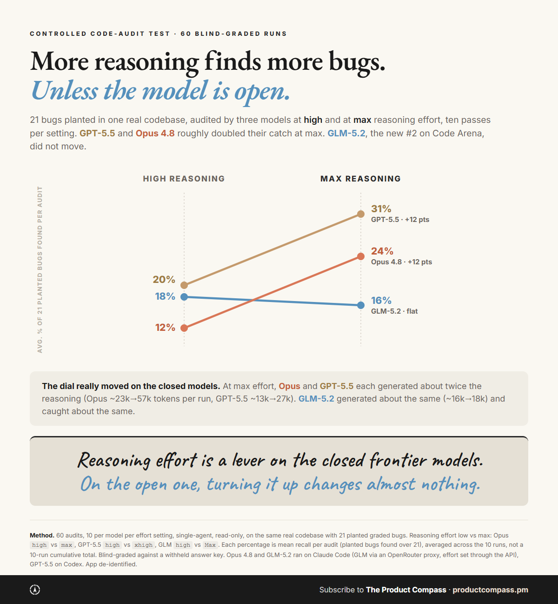
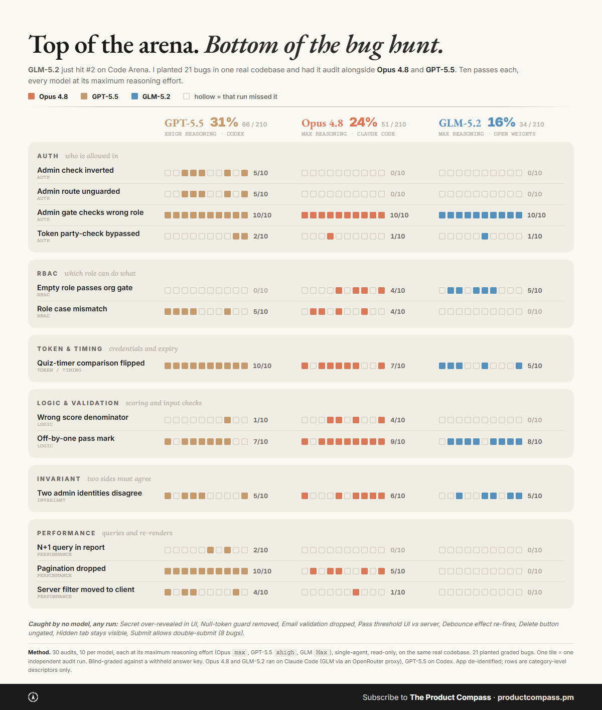

# frontier-vs-open-audit — an open-weights model vs the closed frontier on a real code audit

**Question:** GLM-5.2 (Z.ai, MIT open weights) hit #2 on Code Arena, behind only Claude Fable 5 — the top open-weights model on the board. On a *real* codebase audit, how does it stack up against the closed frontier (Opus 4.8, GPT-5.5)? And does cranking reasoning effort to maximum change the answer?

**Method:** One real app (private; de-identified here). 21 bugs planted by hand across auth, RBAC, token/timing, logic & validation, invariants, performance, and UI. Three models audited the repo — single-agent, **read-only**, same prompt ([prompt.txt](prompt.txt)) — at **two reasoning-effort tiers**: `high`, and each model's **ceiling** (Opus `max`, GPT-5.5 `xhigh`, GLM `Max`). **10 independent runs per model per tier = 60 audits.** Each run's report was **blind-graded** against the planted-bug answer key (model identity hidden from the grader): a run "catches" a bug only when its report names that specific defect. Trap seeds (decoys) were tracked separately to watch for false positives.

- Opus 4.8 and GLM-5.2 ran on the **Claude Code CLI** (`claude -p`). GLM-5.2 is driven through a ~120-line Anthropic-API shim ([harness/glm_claude_proxy.py](harness/glm_claude_proxy.py)) that rewrites the model slug to `z-ai/glm-5.2` and forwards to OpenRouter, with effort set via the API's `reasoning.effort` — so the open model drives the *real* harness, apples-to-apples with Opus.
- GPT-5.5 ran on the **OpenAI Codex CLI** ([harness/codex_audit.py](harness/codex_audit.py), `codex exec --json`, read-only sandbox).

**Results — planted-bug recall at maximum effort (10 runs each, 210 chances per model):**

| Model | Effort | Caught | Recall |
|---|---|---|---|
| GPT-5.5 | xhigh | 66 / 210 | **31%** |
| Opus 4.8 | max | 51 / 210 | **24%** |
| GLM-5.2 (open) | Max | 34 / 210 | **16%** |

Recall = the average share of the 21 planted bugs a model named per audit, across 10 runs (not a 10-run cumulative). Per-bug counts: [recall.csv](recall.csv). Full per-run grid: [matrix.json](matrix.json).

**The effort response — `high` vs ceiling:**

| Model | high | ceiling | Δ | mean reasoning tokens/run |
|---|---|---|---|---|
| Opus 4.8 | 12% | 24% (max) | **+12 pts** | ~23k → ~57k (2.5x) |
| GPT-5.5 | 20% | 31% (xhigh) | **+12 pts** | ~13k → ~27k (2.1x) |
| GLM-5.2 (open) | 18% | 16% (Max) | **flat** | ~16k → ~18k (1.1x) |

Low-effort per-run grid: [matrix_high.json](matrix_high.json). Effort summary: [effort_grid.csv](effort_grid.csv).

**Cost per audit — the open model ran the most expensive, despite the cheapest tokens:**

| Model | Effort | Mean $/audit | Median $/audit |
|---|---|---|---|
| GPT-5.5 | xhigh | **$2.96** | $2.96 |
| Opus 4.8 | max | **$4.77** | $4.56 |
| GLM-5.2 (open) | Max | **$5.66** | $4.68 |

GLM-5.2's tokens are cheap on paper — OpenRouter list is $1.4/M in, $4.4/M out, against Opus's $5/M in, $25/M out. But the audit re-reads the repo every turn, and **OpenRouter exposes no prompt cache for GLM-5.2** (cache-write tokens come back zero), so the open model re-pays full input price for the whole context on every turn. Opus, on the Claude Code CLI, cached ~241k input tokens per run and read them back at $0.5/M. Net: the open model ran *more* expensive per audit than Opus, and ~2x GPT-5.5. This is a harness-and-caching artifact, not a verdict on the model's raw price — a self-hosted GLM with its own KV cache would tell a different story. Cost basis and the cached-token gap: [economics.csv](economics.csv).

**Findings:**
1. **Reasoning effort is a lever on the closed models and a no-op on the open one.** Going from `high` to max roughly doubled both closed models (Opus +12 pts, GPT-5.5 +12 pts) and roughly doubled how much they actually reasoned (~2.5x and ~2.1x the output tokens per run). GLM-5.2's `Max` setting produced about the same reasoning as `high` (~1.1x) and the same recall. The effort you reach for on a frontier model buys ~12 points; on this open model it buys nothing.
2. **At max effort, GPT-5.5 leads; the open model trails by 15 points.** GLM-5.2 (free, self-hostable, MIT) is the weakest of the three at ceiling — about half the leader's recall. The order is effort-dependent: at `high`, GLM (18%) actually edges Opus (12%); the closed models only pull ahead once you pay for max reasoning.
3. **All three are weak single-pass auditors.** Even the leader names under a third of the planted bugs in a typical run, and 8 of the 21 bugs went uncaught by every model across all 10 max-effort runs. None of these is a thorough one-pass auditor.
4. **Recall is unstable run to run.** The same model on the same code returns a different bug list each run — that's why this is 10 runs per cell, not one.

**Caveats:**
- One app, one audit task, n=10 per cell. This is *planted-bug recall*, not a general code-quality score.
- **Effort is each model's real, builder-facing control**, not a normalized internal one: native CLI flags for Opus and GPT-5.5, OpenRouter's `reasoning.effort` for GLM. GLM's flat response is what the setting a builder can actually reach produced — whether the model *could* reason more under a different setup is out of scope here.
- The same audits also surfaced **real pre-existing bugs** in the app (none critical). Those are being fixed; a separate write-up will follow once they're closed.
- **De-identified.** Bug rows are category-level descriptors. The raw per-run reports and the seeded diffs quote the private repo and are **withheld** (the CSV/JSON are content-free). The answer key and seeded source are not published.
- GPT-5.5 ran on the Codex CLI, the Claude pair on the Claude Code CLI — different harnesses. This compares each model in a native agentic harness, not a single unified harness.
- Numbers are blind-graded. If a number here and a post disagree, the data here wins: [@PawelHuryn](https://x.com/PawelHuryn).

**Files:** `README.md`, `recall.csv`, `effort_grid.csv`, `economics.csv`, `matrix.json` (ceiling), `matrix_high.json` (low effort), `effort-curve.png`, `bug-matrix.png`, `prompt.txt`, `harness/` (`glm_claude_proxy.py`, `codex_audit.py`, `build_matrix.py`, `grade_audits.js`). Inputs that quote the private repo (answer key, seeded diffs, raw reports) are withheld.

**Source post:** [@PawelHuryn on X](https://x.com/PawelHuryn/status/2067324156174065677)
