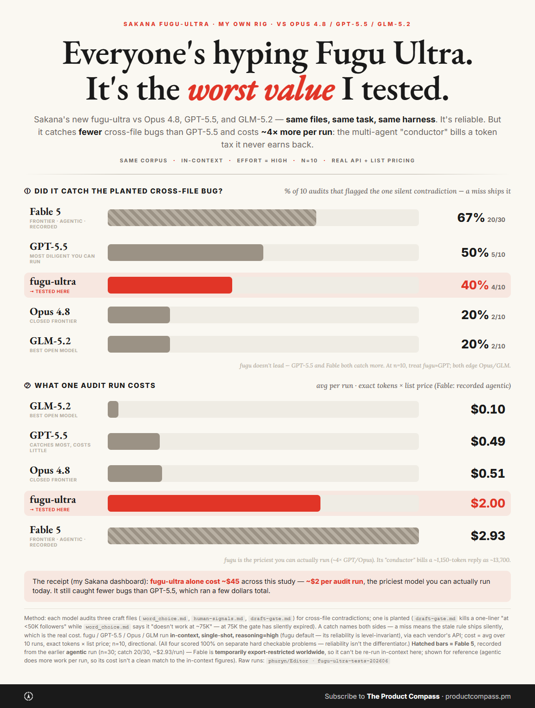

# fugu-ultra-vs-frontier — Sakana's multi-agent conductor vs the frontier, on reliability, cost, and diligence

Sakana AI's **fugu-ultra** bills itself as a *"multi-agent conductor system for complex reasoning tasks."* This set is the independent-skeptic receipt: fugu-ultra run through the same rigs as GLM-5.2, GPT-5.5, Opus 4.8, and Fable 5 — same problems, same grader, new model in the seat — to ask whether the conductor architecture buys anything a single frontier model doesn't.

The short answer: it is reliable, it catches no more cross-file bugs than GPT-5.5, and it costs ~4x more per run while a hidden orchestration tax inflates its real token bill ~12x over what you see in the reply.

## Experiments

| # | Experiment | Question | Headline result |
|---|---|---|---|
| 1 | Reliability by effort | Does fugu-ultra have a cheap-but-wrong mode to fall into, the way an open model's non-thinking tier does? | **No. 64/64 = 100%** correct across both problems and all four effort tiers; GPT-5.5 16/16. Reliability is not the differentiator. |
| 2 | The conductor's token tax | fugu's visible reply is Opus-sized. Is that what you pay for? | A ~1,150-token visible answer bills **~13,700 tokens** (~12x) — the multi-agent orchestration is real and invisible in `content`. |
| 3 | Cost per run | Cheapest tokens win? | **GLM $0.10, GPT-5.5 $0.49, Opus $0.51, fugu $2.00.** fugu is the most expensive model in the panel per run (~4x GPT-5.5/Opus). |
| 4 | Planted cross-file bug (diligence) | Does the conductor catch the silent contradiction the closed frontier flunks? | In-context, n=10: **GPT-5.5 5/10, fugu 4/10, Opus 2/10, GLM 2/10.** fugu ties GPT-5.5 within noise; both edge Opus/GLM. The conductor buys no diligence edge. |

**Headline result (the tweet):** *fugu-ultra is reliable but the worst value here — it catches no more cross-file bugs than GPT-5.5 while costing ~4x per run, and the conductor's hidden ~12x token tax buys no diligence edge.*

## Shared method

- **Models & list prices (per 1M tokens, in / out):** fugu-ultra $5 / $30, GPT-5.5 $5 / $30, Opus 4.8 $5 / $25, GLM-5.2 $1.4 / $4.4. Fable 5's in-context column could not be re-run (see Caveats).
- **Access.** Each model runs on its own vendor API. Sakana fronts fugu-ultra with a GCP load balancer that 403s non-US/JP and datacenter IPs *before auth*; it was reached through a **US SOCKS5 exit** (`harness/sakana.py --proxy socks5://...`). fugu-ultra exposes only the OpenAI Chat Completions shape — no Anthropic `/v1/messages` — so it cannot be driven by the `claude -p` agentic harness the original baselines used.
- **No off-switch.** fugu-ultra's `reasoning_effort` floor is `high` (like Fable 5); the four tiers tested are `default / high / xhigh / max`, not `none / low / medium`.
- **Reliability (Experiment 1).** Two checkable problems, n=8 per cell per effort tier (64 fugu runs; 16 GPT-5.5 runs at `high`). P1 (hard): count positive n<1000 whose square ends in the same last three digits as n → **3** (1, 376, 625). P2 (medium): count 1≤n≤1000 divisible by neither 3 nor 7 → **572**. Graded by exact-match on the answer. Harness: [harness/fugu_reliability.py](harness/fugu_reliability.py), [harness/gpt55_rig.py](harness/gpt55_rig.py).
- **Diligence (Experiment 4).** Each model audits three style-guide files for cross-file contradictions ([prompt.txt](prompt.txt)). One contradiction is **planted**: one file gates a tactic *below a lower follower threshold*, another says the same tactic *stops working at a higher follower count the account has already passed* — so the lower gate has silently expired, and catching it requires reading the two files against each other. **In-context, single-shot, n=10 per model, reasoning=high.** STRICT = the report names both load-bearing thresholds and frames the right conflict; LOOSE = any follower-ceiling mention. Harness: [harness/fugu_audit_incontext.py](harness/fugu_audit_incontext.py), [harness/gpt55_rig.py](harness/gpt55_rig.py), [harness/matrix_incontext.py](harness/matrix_incontext.py) (Opus / GLM / Fable).
- **Fixed corpus prompt (for cost reconstruction).** The three style-guide files plus the instruction are the same input on every in-context run: **57,147 tokens (Sakana tokenizer).** [planted_bug_incontext.csv](planted_bug_incontext.csv) records `total_tokens`, `completion_tokens`, and `orchestration_in` but omits a `prompt_tokens` column, so fugu's cost is reconstructed from this fixed corpus size: input = 57,147 + `orchestration_in`; orchestration output = `total_tokens − 57,147 − completion_tokens − orchestration_in`; total output = `completion_tokens` + orchestration output. This makes the cost reproducible from the CSV.

### Experiment 1 — reliability by effort

fugu-ultra, two checkable problems, n=8 per cell ([reliability.csv](reliability.csv)):

| Problem | default | high | xhigh | max | total |
|---|---|---|---|---|---|
| P1 (hard) | 8/8 | 8/8 | 8/8 | 8/8 | **32/32** |
| P2 (medium) | 8/8 | 8/8 | 8/8 | 8/8 | **32/32** |

**fugu-ultra: 64/64 = 100% correct, every problem, every effort tier.** GPT-5.5 was 16/16 across the same two problems at `high` ([gpt55_reliability.csv](gpt55_reliability.csv)). The effort dial is inert on correctness — there's no reliability to buy back because it starts maxed, with no cheap-but-wrong tier to fall into.

### Experiment 2 — the conductor's hidden token tax

fugu-ultra is a multi-agent conductor: every call fans the prompt across hidden internal agents, billed as `orchestration_*` tokens. The visible reply is a small fraction of what's billed. From [reliability.csv](reliability.csv) (P1 hard, default tier, n=8):

| Prompt | Visible output tokens | True total tokens billed | Ratio |
|---|---|---|---|
| P1 hard math (default) | ~1,154 | ~13,660 | **~11.8x** |

On *visible* output fugu-ultra is Opus-tier verbosity (~1,154 mean), between GLM and Opus and well above terse Fable. But the visible number is a lie about cost: ~12x that is billed under the hood for one hard arithmetic question, invisible in the `content` you read.

### Experiment 3 — cost per run

Exact tokens from each model's in-context audit run × list price (input billed at the in rate, visible+orchestration output at the out rate). For fugu the input includes the fixed 57,147-token corpus prompt the CSV omits (see Method). Means over n=10:

| Model | Mean $/run | Median $/run | Basis |
|---|---|---|---|
| GLM-5.2 (open) | **$0.10** | $0.11 | OpenRouter list, in $1.4 / out $4.4 |
| GPT-5.5 | **$0.49** | $0.49 | OpenAI list, in $5 / out $30 |
| Opus 4.8 | **$0.51** | $0.51 | Anthropic list, in $5 / out $25 |
| fugu-ultra | **$2.00** | $2.15 | Sakana list, in $5 / out $30, 57,147-token corpus + all orchestration tokens |

fugu-ultra is the most expensive model in the panel per run — **~4x GPT-5.5 and Opus**, ~20x GLM — driven by the orchestration tax, not by a higher per-token price. (Median $2.15 > mean because one run, idx 2, barely fanned out across the conductor's sub-agents and cost only $0.77.) Total fugu spend across this set was ~$45. Cost rows: [planted_bug_incontext.csv](planted_bug_incontext.csv), [gpt55_planted_incontext.csv](gpt55_planted_incontext.csv), [opus_planted_incontext.csv](opus_planted_incontext.csv), [glm_planted_incontext.csv](glm_planted_incontext.csv).

### Experiment 4 — planted cross-file bug (diligence)

Strict catch rate, in-context single-shot, n=10 per model, reasoning=high:

| Model | STRICT catch | LOOSE catch | Harness |
|---|---|---|---|
| GPT-5.5 | **5/10** | 7/10 | in-context, single-shot |
| fugu-ultra | **4/10** | 5/10 | in-context, single-shot |
| Opus 4.8 | **2/10** | 2/10 | in-context, single-shot |
| GLM-5.2 (open) | **2/10** | 2/10 | in-context, single-shot |
| Fable 5 | 20/30 recorded | — | agentic `claude -p` (different harness; see Caveats) |

GPT-5.5 and fugu-ultra tie within noise at the top of the single-shot panel; both edge Opus and GLM. fugu-ultra is **not** in the Opus/GLM blind spot — but the multi-agent conductor buys it no diligence edge over a single frontier model that costs a quarter as much. (Two of fugu's 10 runs truncated at `max_tokens=16000` and graded as misses, so its true rate is plausibly 4–6/10.)

## Findings

1. **Reliability is not the differentiator — every model nails the checkable problems.** fugu-ultra is 64/64 and GPT-5.5 16/16 on the hard and medium math, across every effort tier. fugu has no cheap-but-wrong mode to fall into (no off-switch, like Fable 5), so the effort dial moves neither correctness nor much output.
2. **The conductor moves cost off the `content` field and into orchestration you still pay for.** A ~1,150-token visible answer bills ~13,700 tokens — about 12x. If you measure agent cost by the visible reply, you under-count fugu by an order of magnitude.
3. **fugu-ultra is the worst value in the panel.** $2.00/run vs GPT-5.5's $0.49 and Opus's $0.51 — **~4x the price** for the same diligence (4/10 vs GPT-5.5's 5/10, a tie within noise) and the same reliability (100%). The conductor architecture buys no measurable edge here over a single frontier model.
4. **n=1 would have told the wrong story on diligence.** The first single diagnostic run *missed* the planted contradiction (it surfaced other contradictions and walked past the planted one); the batch caught it ~4/10. Single-shot model evals — the screenshot-on-X genre — are noise at this catch rate.

## Caveats

- **n=10 is directional.** GPT-5.5 (5/10) vs fugu-ultra (4/10) is a tie within noise; both edge Opus/GLM (2/10). Reliability is n=8 per cell.
- **In-context single-shot, not the agentic harness.** fugu has no Anthropic/agentic endpoint, so the diligence comparison is everyone pasted the same three files into one call — *not* the multi-turn `claude -p` harness the original baselines used. This is a mild edge to fugu (single-shot, all files in hand). fugu's *own* agentic harness (OpenAI tool-calling) over-searched and never converged to a report within the round budget, so 4/10 may be its in-context best case, not its deployed-agent case.
- **Fable 5 is not directly comparable.** The Anthropic endpoint for Fable 5 was export-restricted worldwide at run time (404 on every call), so it could not be re-run in-context. Its 20/30 (67%) figure is an *earlier recorded agentic* number on the `claude -p` harness; its ~$2.93/run is likewise on a different basis. Both are shown for context only, not as a clean head-to-head.
- **Costs are list-price estimates**, computed from the token counts in the CSVs at each vendor's published rates — not from invoices. No prompt-cache discount is applied (the in-context audits send the full corpus fresh each run). The CSVs omit a `prompt_tokens` column, so fugu's cost reconstructs using the **fixed corpus prompt of 57,147 tokens (Sakana tokenizer)** measured on the diagnostic run — logged explicitly in Method so the number is reproducible from `total_tokens` / `completion_tokens` / `orchestration_in`. The fugu figure averages over the 10 in-context runs (one, idx 2, barely fanned out and cost $0.77): **mean $2.00, median $2.15**.
- **The audited files are private and withheld** (honesty bar). Only the generic audit instruction ([prompt.txt](prompt.txt)) is published; the three style-guide files, the planted contradiction's exact wording, and the grader's answer-key tokens are not. The CSVs are content-free (grades + token counts). Raw per-run model responses quote the private repo and are withheld.
- **Run from a Windows laptop, June 2026.** Wall-clock seconds in the CSVs are raw-API (incl. the SOCKS5 hop for fugu) and are not comparable to the CLI baselines — only token counts and correctness are.
- Numbers here are graded from the raw logs. If a number here and a post disagree, the data here wins: [@PawelHuryn](https://x.com/PawelHuryn).

**Files:** `README.md`, `reliability.csv`, `planted_bug_incontext.csv`, `gpt55_reliability.csv`, `gpt55_planted_incontext.csv`, `opus_planted_incontext.csv`, `glm_planted_incontext.csv`, `scorecard.png`, `prompt.txt`, `harness/` (`sakana.py`, `fugu_reliability.py`, `fugu_audit_incontext.py`, `gpt55_rig.py`, `matrix_incontext.py`). The audited style-guide files, the answer key, and the raw per-run reports quote the private content repo and are **withheld**.

**Source post:** <post-url>
