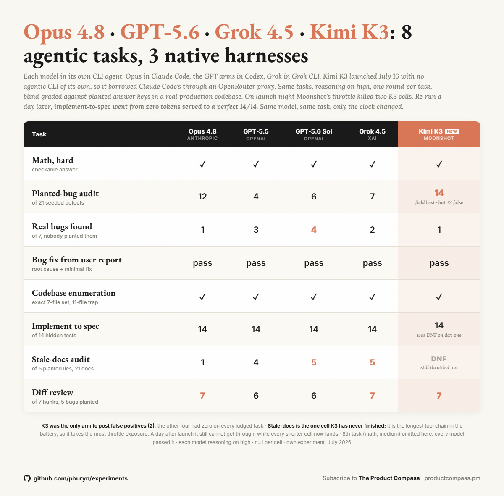

# 01 — Eight-task scoreboard: does Kimi K3 match the frontier?

**Question:** Moonshot shipped Kimi K3 on July 16, 2026 — at 2.8 trillion parameters, the largest open-weight model released to date, with community posts claiming it beats the closed frontier. On a real codebase, run through the same 8-task agentic battery as Opus 4.8, GPT-5.5, GPT-5.6 Sol and Grok 4.5, does it actually match them?

**Method:** One real app (private; de-identified here). Eight tasks: two math problems with checkable answers, a 21-planted-bug audit, a bug-fix from a user report, a codebase enumeration with a decoy trap, an implement-to-spec task graded by 14 hidden `bun test` cases, a stale-docs audit with 5 planted lies across 21 docs, and a 7-hunk diff review. **n=1 per cell.** Reasoning effort `high` requested everywhere. Blind-graded against planted answer keys; the implement task is graded deterministically by the hidden test suite.

Each model ran in its **own native agentic harness** — this is not one unified harness:

| Model | Harness |
|---|---|
| Opus 4.8 | Claude Code CLI (`claude -p`) |
| GPT-5.5 | Codex CLI (`codex exec`) |
| GPT-5.6 Sol | Codex CLI (`codex exec`) |
| Grok 4.5 | grok CLI (ACP) |
| **Kimi K3** | **Claude Code CLI, via an Anthropic-API shim to OpenRouter** |

K3 has no agentic CLI of its own, so it borrowed Claude Code's: [`../02-day-one-capacity/harness/kimi_proxy.py`](../02-day-one-capacity/harness/kimi_proxy.py) rewrites the model slug to `moonshotai/kimi-k3` and forwards to OpenRouter, so the open model drives the *real* harness — the same one Opus used, apples-to-apples with Opus specifically.

**Results:**

| Task | Opus 4.8 | GPT-5.5 | GPT-5.6 Sol | Grok 4.5 | Kimi K3 |
|---|---|---|---|---|---|
| Math, hard | pass | pass | pass | pass | pass |
| Math, medium | pass | pass | pass | pass | pass |
| Planted-bug audit (of 21) | 12 | 4 | 6 | 7 | **14** |
| Real bugs found (of 7, unplanted) | 1 | 3 | **4** | 2 | 1 |
| False positives | 0 | 0 | 0 | 0 | **2** |
| Bug fix from user report | pass | pass | pass | pass | pass |
| Codebase enumeration (7-file set, 11-file trap) | exact | exact | exact | exact | exact |
| Implement to spec (of 14 hidden tests) | 14 | 14 | 14 | 14 | **14** |
| Stale-docs audit (of 5 planted lies) | 1 | 4 | **5** | **5** | **DNF** |
| Diff review (of 7 hunks) | **7** | 6 | 6 | **7** | **7** |

Full grid: [scoreboard.csv](scoreboard.csv). K3 per-task wall-clock, tokens and cost: [metrics_kimi.csv](metrics_kimi.csv). The stale-docs DNF is a throttle result, not a wrong answer — see [02-day-one-capacity](../02-day-one-capacity/).

**Findings:**

1. **K3 matched or beat all three frontier models on 6 of the 7 tasks it finished.** Both math tasks, the bug fix, the enumeration trap, the implement task (14/14), and the diff review (7/7, tied best with Opus and Grok 4.5). On a day-one open-weight model, that is the headline.
2. **It caught more planted bugs than any closed model: 14 of 21, against Opus's 12.** Nobody else got past 7. Planted-bug recall is the one task where K3 leads outright rather than ties.
3. **It is also the only model in the field that reported bugs that were not there.** Two false positives, where the other four returned zero across every judged task. Best recall in the set, and the only one paying for it in precision — the same instinct producing both, on n=1.
4. **Its clear weakness is finding real, unplanted bugs: 1 of 7, the worst in the field.** GPT-5.6 Sol found 4. K3 is strong at spotting defects someone put there and weak at noticing the ones nobody flagged.

**Caveats:**

- **n=1 per cell.** Directional, not a ranking. The same rig at n=10 (a different model set) showed planted-bug recall is unstable run to run: [../../frontier-vs-open-audit/](../../frontier-vs-open-audit/). Treat single-run task scores accordingly.
- **Not one harness.** Each model ran in its own native CLI agent; K3 borrowed Claude Code's because it has none. Only K3 and Opus shared a harness. This compares models-in-native-harnesses, not models-in-a-fixed-harness.
- **The stale-docs cell is missing, not zero.** K3 never finished it across five attempts. Scoring it as 0 would be wrong; see the capacity experiment.
- **K3 ran on launch-day infrastructure** while the other four ran on stable, unthrottled harnesses. That is not an equal test surface, and it is the subject of [02-day-one-capacity](../02-day-one-capacity/).
- **The four non-K3 columns are not re-runs.** They are lifted verbatim from [five-models-three-harnesses/](../../five-models-three-harnesses/) (July 10, 2026), which is the source of record for this rig's method, per-model characters, and cost accounting. K3 was added July 16–17 against the identical tasks, prompts and answer keys. Grok 4.3 ran in that set and is dropped here.
- **K3 breaks that set's "zero false positives from any arm" finding.** It is the first arm in this rig to report bugs that were not there, and the first to take planted-bug recall off Opus.
- **De-identified.** The app is private. Raw per-run model reports quote the repo and are **withheld**; the CSVs and grades here are content-free. Answer keys and seeded source are not published. Both task prompts are self-contained specs and are published verbatim: [T6](../02-day-one-capacity/prompts/T6-implement-to-spec.md), [T7](../02-day-one-capacity/prompts/T7-stale-docs-audit.md).
- Cost figures in `metrics_kimi.csv` are OpenRouter-metered for K3 and computed at K3's list rate ($3/M in, $15/M out, $0.30/M cache read). Do **not** rank them against natively-metered arms; the cache accounting differs.

**Source post:** [@PawelHuryn on X](https://x.com/i/status/2078039188834783367)
