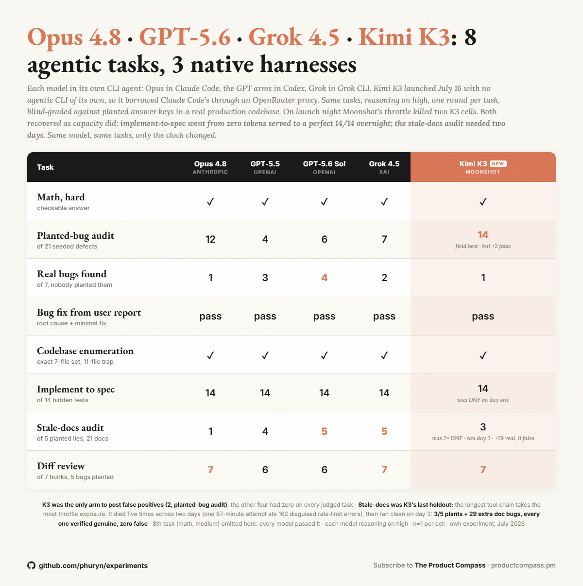

# 03 — Day-three recovery: the DNF cell ran clean once the queue cooled

**Question:** Experiment [02](../02-day-one-capacity/) ended with the stale-docs cell DNF after five attempts, the last of them a 67-minute run in which a fixed proxy absorbed **162** disguised throttles and still timed out. If that DNF was capacity rather than the model, the cell should complete once Moonshot's pool cools — with nothing changed but the date. Does it?

**Method:** Identical to attempt 5: same model (`moonshotai/kimi-k3` via OpenRouter), same task prompt ([T7-stale-docs-audit.md](../02-day-one-capacity/prompts/T7-stale-docs-audit.md), published verbatim), same target repo, same Claude Code harness with the same read-only tool manifest, same fixed proxy ([kimi_proxy2.py](../02-day-one-capacity/harness/kimi_proxy2.py), `--reasoning-effort max`), same runner ([run_kimi_t7_direct.py](../02-day-one-capacity/harness/run_kimi_t7_direct.py)). Re-run July 18 at 10:15 CEST — 25.5 hours after attempt 5, ~38 hours after launch. Pool health probed first with 4 small OpenRouter chat requests. Grading: the 5 planted lies are graded against the answer key (withheld); every extra discrepancy the model reported was independently re-checked claim-by-claim against the codebase (does the doc say it; does the code contradict it) by a separate verification pass.

**Results — the attempt ledger, full arc:**

| Attempt | When (CEST) | Outcome |
|---|---|---|
| 1–2 | Jul 16, launch night | timeout (25 min / 40 min caps), nothing returned |
| 3 | Jul 17, 08:10 | `api_error` at 125 s, 8 turns |
| 4 | Jul 17, 08:13 | `api_error` at 267 s, 28 turns |
| 5 | Jul 17, 08:44 (fixed proxy) | "Request timed out" at 4,033 s after the proxy absorbed **162** disguised throttles |
| **6** | **Jul 18, 10:15** | **completed: 4,070 s (68 min), clean `exit=0`** |

**Results — the wire, day 2 vs day 3, same proxy, same config:**

| | Attempt 5 (Jul 17) | Attempt 6 (Jul 18) |
|---|---|---|
| Rate-limit events in the proxy log | **162** in 67 min | **0** in 68 min |
| Pre-run availability probe | not run (02's probes that morning: ~50% `engine_overloaded` on first-party routes) | **4/4 OK** at 2–10 s |
| Outcome | timed out, no result | completed, scored |

Raw day-3 log slice: [throttle-day3.log](throttle-day3.log). The only upstream anomalies on day 3 are three 404s from the CLI probing endpoints OpenRouter does not serve — zero throttle events.

**Results — the score** ([grades_T7_kimi.json](grades_T7_kimi.json), run metrics [t7_metrics.csv](t7_metrics.csv)):

| Metric | K3, day 3 | Field (from [01](../01-eight-task-scoreboard/)) |
|---|---|---|
| Planted lies found (of 5) | **3** — the wrong-table-name, wrong-default-value and nonexistent-feature plants | Opus 4.8: 1 · GPT-5.5: 4 · GPT-5.6 Sol: **5** · Grok 4.5: **5** |
| Missed | 2 — the wrong-function-name and wrong-route-path plants; both files explicitly cleared as accurate | |
| Extra discrepancies reported | **29 — 29/29 verified genuine, 0 false positives** | |
| Wall / output | 4,070 s · 64,234 tokens | |

**Findings:**

1. **The cell that died five times ran clean with nothing changed but the date.** Same model, task, prompt, harness, proxy, flags. This closes 02's arc with both halves in hand: the implement cell recovered in 13 hours, the heaviest cell needed until day 3. The heavier the tool chain, the longer the provider's queue owns your result.
2. **The recovery is measured on the wire, not inferred.** 162 rate-limit events in 67 minutes on day 2; zero in 68 minutes on day 3, through the same proxy with the same retry rules. A day-one benchmark and a day-three benchmark ran against different products.
3. **Once it could run, K3 scored mid-field: 3 of 5 plants** — above Opus 4.8's 1, below the 5/5 of GPT-5.6 Sol and Grok 4.5 — **plus 29 extra genuine stale-doc findings with zero false positives.** The false-positive instinct from the planted-bug audit (2 there, the only arm with any) did not show up on this task.
4. **The bill is cache reads.** 15.7M cache-read tokens against 254K fresh input and 64K output: at list rates, $4.71 of the $6.44 cell cost is cache reads. A 68-minute agentic loop re-bills its context many times; pricing an agentic workload from input/output rates alone will miss most of the bill.

**Caveats:**

- **n=1, and an uncontrolled natural experiment.** 25.5 hours passed between attempts; the endpoint's load is unobserved. The claim is narrow: five failures, then a clean pass, with the on-wire throttle count going 162 → 0.
- **This cell ran at `--reasoning-effort max`** (the proxy's flag, per Moonshot's documented contract) while every other scored cell in this set — and the whole comparison field — ran at requested `high`. 02 disclosed the flag when the cell had produced no score; now it has one. Read the 3/5 with that in mind. The capacity findings (1–2) do not depend on it.
- **Transport differs from the field:** OpenRouter through a retry shim vs native harnesses. The 68-minute wall is a ceiling, not a comparable speed number.
- **The extras verification is an LLM pass**, claim-by-claim against the code, not human review. The per-claim verdicts quote the private repo and are withheld with the raw report; the counts are what is publishable.
- **De-identified.** The raw model report quotes the target repo throughout and is withheld. The grades JSON is content-free (plant types and counts only). The answer key is not published.
- The throttle numbers describe July 16–18, 2026 only. This experiment expires by design — that is its point.
- If a number here and a post disagree, the data here wins: [@PawelHuryn](https://x.com/PawelHuryn).

**Source post:** [the day-three QT](https://x.com/i/status/2078453621398630706), quoting [the day-one post](https://x.com/i/status/2078039188834783367).
